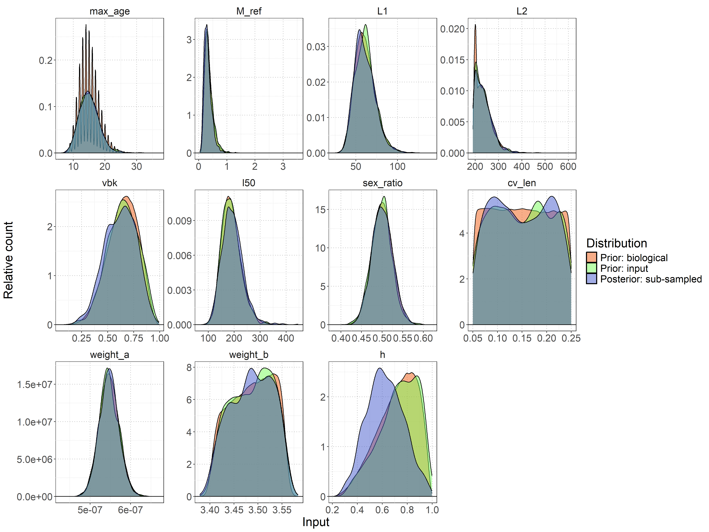
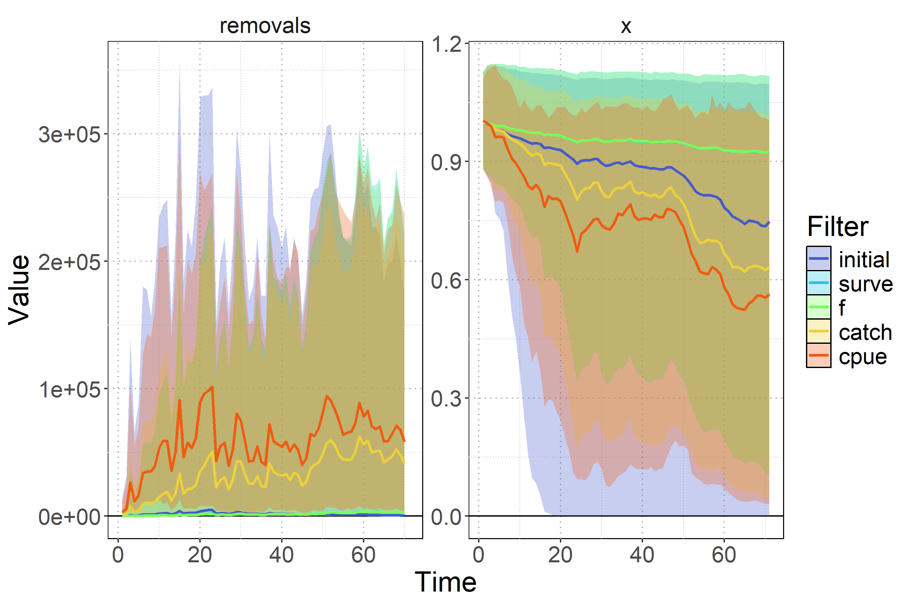

---
# Define logo paths as Quarto variables
logo1: "static/spc-logo.png"
logo2: "static/noaa-fisheries-logo.png"

format:
  revealjs:
    theme: [default, customizations/presentation-custom.scss]
    slide-number: true
    footer: "WCPFC-SC21-2025/SA-WP-07"
    include-in-header:
      - text: |
          <script>
          // Access Quarto variables in JavaScript
          window.quartoLogos = {
            logo1: '',
            logo2: ''
          };
          </script>
          <script src="customizations/add-logos.js"></script>
          <script src="customizations/slide-background.js"></script>
    css: customizations/logos.css
    self-contained: true
resources:
  - "static/**"  # Include all files in the static directory
---

```{r}
#| label: set-paths
#| echo: false
#| warning: false
#| message: false
library(data.table)
library(ggplot2)
library(magrittr)

proj_dir = this.path::this.proj()
dir_model_runs = file.path(proj_dir,"data","output","model_runs")
diag_model = "0100-dwfn-exeoFSTTGF-cf0.2-nb-qnewK-s1-o52b-o54b_0"

# Define model description configuration (without run_number - will be matched from data)
model_desc_config = fread(file.path(proj_dir,"data","output","model_desc_config.csv"))
model_desc_config[,short_name:=sprintf("%04d", short_name)]
model_desc_config[,short_name:=factor(short_name,levels=short_name)]

# Read catch data
catch_dt = fread(file.path(proj_dir, "data", "input", "catch.csv"))

# Load effort data 
effort_dt = fread(file.path(proj_dir, "data", "input", "WCPFC_L_PUBLIC_BY_FLAG_YR.CSV")) %>%
                .[, lat_short_d := ifelse(grepl("S$", lat_short), 
                                        -as.numeric(gsub("[NS]", "", lat_short)), 
                                        as.numeric(gsub("[NS]", "", lat_short))) + 2.5] %>%
                .[, lon_short_d := ifelse(grepl("W$", lon_short), 
                                        360 - as.numeric(gsub("[EW]", "", lon_short)), 
                                            as.numeric(gsub("[EW]", "", lon_short))) + 2.5] %>%
                .[lat_short_d > -60 & lat_short_d < 0 & lon_short_d < 230] %>%
                .[!(lat_short_d > -5 & lon_short_d > 210)] %>%
                .[,.(effort_scaled = sum(hhooks)/1e6),by=yy] %>%
                .[yy %in% 1952:2022] %>%
                setnames(., "yy", "time")
    
catch_annual = catch_dt[,.(total_catch = sum(Obs * 1000)), by = .(year = floor(Time))]
setorder(catch_annual, year)
    
# Merge with effort data
catch_effort_annual = merge(catch_annual, effort_dt, by.x = "year", by.y = "time", all.x = TRUE)
    
# Fill missing effort with mean (if any)
if(any(is.na(catch_effort_annual$effort_scaled))) {
    catch_effort_annual[is.na(effort_scaled), effort_scaled := mean(effort_scaled, na.rm = TRUE)]
}

catch_effort_annual[,effort_scaled:=(effort_scaled*1e6*100)/1e3]
catch_effort_annual[,nominal_cpue:=total_catch/effort_scaled]

# Read summary data
ens_summary = fread(file.path(proj_dir,"data","output","ens_derived_summary.csv"))
ens_probs = fread(file.path(proj_dir,"data","output","ens_derived_probs.csv"))
ens_joint_probs = fread(file.path(proj_dir,"data","output","ens_joint_probs.csv"))
ens_forecast_summary = fread(file.path(proj_dir,"data","output","ens_forecast_summary.csv"))
ens_forecast_probs = fread(file.path(proj_dir,"data","output","ens_forecast_probs.csv"))
```

## {.left-bg-image}

<!-- Content area -->

::: {.absolute top=20%}

[2025 Stock Assessment of Striped Marlin in the Southwest Pacific Ocean]{.blue-title}

[*Part II: Data-moderate Bayesian Surplus Production Model Approach*]{style="font-size:0.85em;"}

[N. Ducharme-Barth, C. Castillo-Jordán, F. Carvalho, and P. Hamer]{style="font-size:0.5em;"}  

[WCPFC-SC21 • Nuku'alofa, Tonga • 13–21 August 2025]{.blue style="font-size:0.5em;"}

:::

## Openscience {.narrow-left-bg-image}

::: {.absolute width=80% left=10% top=20% style="font-size:0.85em; text-align: center;"}

All data inputs, model code, key model outputs, figures, report and presentation files are publicly available on GitHub:

<https://n-ducharmebarth-noaa.github.io/2025-swpo-mls-bspm/>

:::

{.absolute left=40% top=57% width=22% height=auto style="box-shadow: 0 0 2rem 0 rgba(0, 0, 0, .5); border-radius: 5px;"}

## Assessment context {.narrow-left-bg-image .smaller}

::: {.incremental}
- Strategic shift from integrated age-structured model to a Bayesian data-moderate approach
- Previous challenges with:
  - Data conflicts and poor fits to size composition 
  - Challenges estimating population scale
- [Bayesian Surplus Production Model (BSPM) offers simplified yet robust alternative when data limitations exist]{.blue}
- Complements integrated assessment (Part I) for holistic stock status view
:::

## Why BSPM? {.narrow-left-bg-image .smaller}

::: {.absolute width=50% left=0%}

::: {.fragment .fade-in fragment-index=1}
**Advantages:**

- Focuses on estimating [productivity]{.blue} and [scale]{.blue} given catch and index data 
- Efficient exploration of parameter space
- Explicitly incorporates biological uncertainty through priors
- Proven robust and effective for pelagic fish assessments
:::
:::

::: {.absolute width=50% left=55%}
::: {.fragment .fade-in fragment-index=2}
**Trade-offs:**

- Simplifies complex age-structured dynamics
- Assumes single well-mixed population
- Knife-edged selectivity assumption
:::

:::

## Model framework {.narrow-left-bg-image .smaller}

::: {.absolute width=100% left=0% style="font-size:0.75em;"}

::: {.fragment .fade-in fragment-index=1}
**Fletcher-Schaefer production model**
:::

::: {.fragment .fade-in fragment-index=2}
**Population dynamics:**
$$N_t = \left(N_{t-1} + \text{Production}_{t-1}\right) \times \text{Process error}_{t} \times \text{Fishing survival}_{t-1}$$
:::

::: {.fragment .fade-in fragment-index=3}
**Fishing impact linked to effort:**
$$\text{Fishing survival}_{t} \text{inversely proportional to} \text{Fishing mortality}_t$$
$$\text{Fishing mortality}_{t} = \text{Catchability}_{t} \times \text{Fishing effort}_t$$
:::

::: {.fragment .fade-in fragment-index=4}
**Key features:**

- True population (numbers) is treated as an unobserved random variable
- Model only fits to observations of relative abundance and catch
- Catchability is allowed to vary temporally so fishing mortality can match catch
- Biology captured in `Production` as max rate of population growth $R_{Max}$
:::

:::

## Input data {.narrow-left-bg-image .smaller}


::: {.fragment .fade-out fragment-index=2}
::: {.fragment .fade-in fragment-index=1}
::: {.absolute width=45% left=0% top=12% style="font-size:0.75em;"}
**Catch data:**

- Aggregated annual removals in numbers of individuals
:::

::: {.absolute width=45% left=55% top=12% style="font-size:0.75em;"}
**Effort data:**

- Annual longline effort (hooks fished)
:::
:::
:::

::: {.fragment .fade-in fragment-index=2}
::: {.absolute width=100% left=0% top=12% style="font-size:0.75em;"}
**Standardized CPUE indices:**

- DWFN longline index (1979-2022) & New Zealand recreational sportfish indices (1975-2022)
- Several observer-based indices explored as sensitivities
:::
:::

::: {.fragment .fade-in fragment-index=3}
::: {.absolute top=40% right=2% width=25%}
::: {.callout-note}
## Note
Blue line is a moving average and not a model fit!
:::
:::
:::


::: {.fragment .fade-out fragment-index=2}
::: {.fragment .fade-in fragment-index=1}
::: {.absolute top=35%}

```{r}
#| echo: false
#| warning: false
#| message: false
#| fig-height: 4
#| fig-width: 6

# Create histogram of annual catch
catch_effort_annual[,.(year,total_catch,effort_scaled)] %>%
  melt(.,id.vars=c("year")) %>%
  .[,variable:=factor(variable,levels=c("total_catch","effort_scaled"),labels=c("Catch","Effort"))] %>%
ggplot() +
facet_wrap(~variable,nrow=2,scales="free_y") +
  geom_col(aes(x = year, y = value),fill = "gray60", alpha = 0.8, width = 0.8) +
  geom_hline(yintercept=0) +
  scale_x_continuous(breaks = seq(1950, 2020, 10), 
                     limits = c(1950, 2025)) +
  scale_y_continuous(labels = scales::comma_format(scale = 1e-3, suffix = "K"),
                     expand = expansion(mult = c(0, 0.05))) +
  labs(x = "Year",
       y = "Annual catch and effort") +
  theme(
    panel.background = element_rect(fill = "white", color = "black", linetype = "solid"),
    panel.grid.major = element_line(color = 'gray70', linetype = "dotted"), 
    panel.grid.minor = element_line(color = 'gray70', linetype = "dotted"),
    strip.background = element_rect(fill = "white"),
    legend.key = element_rect(fill = "white")
  )
```

:::
:::
:::

::: {.fragment .fade-in fragment-index=2}
::: {.absolute top=40%}

```{r}
#| echo: false
#| warning: false
#| message: false
#| fig-height: 4
#| fig-width: 8

# load additional cpue indices
  cpue_dt = fread(file.path(proj_dir,"data","input","cpue.csv"))
    au_cpue_dt = fread(file.path(proj_dir,"data","input","AU_cpue.csv"))
    nz_cpue_dt = fread(file.path(proj_dir,"data","input","NZ_cpue.csv"))
    obs_cpue_dt = fread(file.path(proj_dir,"data","input","obs-idx-with_OP.csv"))
    obs_cpue_no_PF_dt = fread(file.path(proj_dir,"data","input","obs-idx-with_OP_no_PF.csv"))
    obs_cpue_PF_only_dt = fread(file.path(proj_dir,"data","input","obs-idx-with_OP_PF_only.csv"))

# prepare data matrices    
    time_years = catch_effort_annual$year
    n_years = length(time_years)
    
    index_mat = matrix(NA, nrow = n_years, ncol = 6)
    se_mat = matrix(NA, nrow = n_years, ncol = 6)

    # dwfn cpue
    cpue_years = floor(cpue_dt$Time)
    for(i in 1:nrow(cpue_dt)) {
        year_idx = which(time_years == cpue_years[i])
        if(length(year_idx) > 0) {
            index_mat[year_idx, 1] = cpue_dt$Obs[i]
            se_mat[year_idx, 1] = cpue_dt$SE[i]
        }
    }

    # australia cpue
    for(i in 1:nrow(au_cpue_dt)) {
        year_idx = which(time_years == au_cpue_dt$year[i])
        if(length(year_idx) > 0) {
            index_mat[year_idx, 2] = au_cpue_dt$obs[i]/mean(au_cpue_dt$obs)
            se_mat[year_idx, 2] = au_cpue_dt$se_log[i]
        }
    }

    # new zealand cpue
    for(i in 1:nrow(nz_cpue_dt)) {
        year_idx = which(time_years == nz_cpue_dt$year[i])
        if(length(year_idx) > 0) {
            index_mat[year_idx, 3] = nz_cpue_dt$ob[i]/mean(nz_cpue_dt$ob)
            se_mat[year_idx, 3] = nz_cpue_dt$se_log[i]
        }
    }

    # Observer CPUE
    # calc SE from quantiles
    obs_cpue_dt[, se_from_quantiles := (Q97.5 - Q2.5) / (2 * 1.96)]
    for(i in 1:nrow(obs_cpue_dt)) {
        year_idx = which(time_years == obs_cpue_dt$Year[i])
        if(length(year_idx) > 0) {
            index_mat[year_idx, 4] = obs_cpue_dt$Estimate[i]/mean(obs_cpue_dt$Estimate)
            se_mat[year_idx, 4] = obs_cpue_dt$se_from_quantiles[i]
        }
    }

    # calc SE from quantiles
    obs_cpue_no_PF_dt[, se_from_quantiles := (Q97.5 - Q2.5) / (2 * 1.96)]
    for(i in 1:nrow(obs_cpue_no_PF_dt)) {
        year_idx = which(time_years == obs_cpue_no_PF_dt$Year[i])
        if(length(year_idx) > 0) {
            index_mat[year_idx, 5] = obs_cpue_no_PF_dt$Estimate[i]/mean(obs_cpue_no_PF_dt$Estimate)
            se_mat[year_idx, 5] = obs_cpue_no_PF_dt$se_from_quantiles[i]
        }
    }

    # calc SE from quantiles
    obs_cpue_PF_only_dt[, se_from_quantiles := (Q97.5 - Q2.5) / (2 * 1.96)]
    for(i in 1:nrow(obs_cpue_PF_only_dt)) {
        year_idx = which(time_years == obs_cpue_PF_only_dt$Year[i])
        if(length(year_idx) > 0) {
            index_mat[year_idx, 6] = obs_cpue_PF_only_dt$Estimate[i]/mean(obs_cpue_PF_only_dt$Estimate)
            se_mat[year_idx, 6] = obs_cpue_PF_only_dt$se_from_quantiles[i]
        }
    }

# Create data frame for plotting using data.table
colnames(index_mat) = c("DWFN", "Australia", "New Zealand", 
                        "Observer (all)", "Observer (no PF)", "Observer (PF only)")

# Convert matrices to data.table format
plot_dt = data.table(
    year = rep(time_years, ncol(index_mat)),
    index = rep(colnames(index_mat), each = nrow(index_mat)),
    obs = as.vector(index_mat),
    se = as.vector(se_mat)
)

# Filter out missing values and calculate confidence intervals
plot_dt <- plot_dt[!is.na(obs) & !is.na(se)]
plot_dt[, `:=`(
    # Calculate bias-corrected 95% lognormal confidence intervals
    # Bias correction: meanlog = log(obs) - 0.5*se^2
    meanlog_corrected = log(obs) - 0.5 * se^2,
    lower = qlnorm(0.025, meanlog = log(obs) - 0.5 * se^2, sdlog = se),
    upper = qlnorm(0.975, meanlog = log(obs) - 0.5 * se^2, sdlog = se)
)]

# Set factor levels for consistent ordering
plot_dt[, index := factor(index, levels = colnames(index_mat))]

# Create the plot
ggplot(plot_dt, aes(x = year, y = obs)) +
    geom_hline(yintercept = 1, linetype = "solid", color = "black") +
    geom_segment(aes(x = year, xend = year, y = lower, yend = upper), 
                 color = "black", linewidth = 0.5) +
    geom_smooth(method = "loess", se = FALSE, color = "blue", linewidth = 0.8, span=0.4) +
    geom_point(color = "white", fill = "black", shape = 21, size = 1.5) +
    facet_wrap(~ index, scales = "free_y") +
    scale_x_continuous(breaks = seq(1980, 2020, 20)) +
    scale_y_continuous(expand = expansion(mult = c(0.05, 0.05))) +
    labs(x = "Year", y = "Standardized Index") +
    theme(
        panel.background = element_rect(fill = "white", color = "black"),
        panel.grid.major = element_line(color = 'gray70', linetype = "dotted"), 
        panel.grid.minor = element_line(color = 'gray70', linetype = "dotted"),
        strip.background = element_rect(fill = "white"),
        legend.key = element_rect(fill = "white"),
        strip.text = element_text(size = 10)
    )
```

:::
:::

## Model development approach {.narrow-left-bg-image .smaller}

::: {.absolute width=50% left=0% style="font-size:0.75em;"}

::: {.fragment .fade-in fragment-index=1}
**1. Develop priors:**

- Use biological simulation framework to develop initial prior for $R_{Max}$ and production function shape parameter $n$
- Develop priors for population scale and catchability based on maximum observed catch and early period CPUE
:::

::: {.fragment .fade-in fragment-index=2}
**2. Prior pushforward:**

- Pass random parameter combinations through the population dynamics model
- Filter parameter combinations for biological and fishery realism
- Develop a multivariate prior based on emergent parameter correlations
:::

:::

::: {.absolute top=25% left=55%}
::: {.fragment .fade-in fragment-index=3}
**3. Fit models to data 🤩**

- Evaluate model performance (fits & diagnostics)
- Draw inference from posterior updates
- Consider sensitivities to data inputs 
:::
:::


::: {.fragment .fade-out fragment-index=2}
::: {.fragment .fade-in fragment-index=1}
{.absolute left=55% top=25% height=50% width=auto style="box-shadow: 0 0 2rem 0 rgba(0, 0, 0, .5); border-radius: 5px;"}
:::
:::

::: {.fragment .fade-out fragment-index=3}
::: {.fragment .fade-in fragment-index=2}
{.absolute left=55% top=25% height=50% width=auto style="box-shadow: 0 0 2rem 0 rgba(0, 0, 0, .5); border-radius: 5px;"}
:::
:::

## Diagnostic model {.narrow-left-bg-image .smaller}

```{r}
#| echo: false
#| warning: false
#| message: false

# Read summary diagnostics
summary_diagnostics <- fread(file.path(proj_dir, "data", "output", "summary_retro0.csv"))

# Match model config to actual run numbers in the data
summary_diagnostics[, short_name := substr(run_number, 1, 4)]

# Preserve the original CSV order by keeping the factor levels
original_order <- levels(model_desc_config$short_name)

model_desc_config_temp <- merge(model_desc_config, 
                          summary_diagnostics[, .(short_name, run_number)], 
                          by = "short_name", 
                          all.x = TRUE)

# Restore the original order from CSV
model_desc_config_temp[, short_name := factor(short_name, levels = original_order)]
model_desc_config_temp <- model_desc_config_temp[order(short_name)]

# Function to apply formatting based on configuration
apply_formatting <- function(value, format_spec) {
  switch(format_spec$format,
    "identity" = value,
    "round" = round(value, format_spec$digits),
    "multiply" = if(!is.null(format_spec$round)) round(value * format_spec$factor, format_spec$round) else round(value * format_spec$factor),
    "percent" = paste0(round(value * 100, format_spec$digits), "%"),
    value  # fallback
  )
}

# Define diagnostics table configuration
diagnostics_config <- list(
  columns = list(
    "Model" = list(var = "model_label", format = "identity"),
    "Max $\\hat{R}$" = list(var = "max_rhat", format = "round", digits = 3),
    "Min ESS" = list(var = "min_neff", format = "multiply", factor = 1000, round = 0),
    "Divergent" = list(var = "divergent", format = "multiply", factor = 1000, round = 0),
    "Tree Depth" = list(var = "treedepth", format = "identity")
  )
)

# Create diagnostics table
# Filter data to only models we have configs for
filtered_data <- summary_diagnostics[run_number %in% model_desc_config_temp$run_number]

# Add model labels using match instead of merge to avoid column issues
filtered_data[, model_index := match(run_number, model_desc_config_temp$run_number)]
filtered_data[, short_name := model_desc_config_temp$short_name[model_index]]
filtered_data[, model_label := paste0("`", as.character(short_name), "`")]

# Ensure proper ordering by the original CSV order
filtered_data[, short_name := factor(as.character(short_name), levels = levels(model_desc_config_temp$short_name))]
filtered_data <- filtered_data[order(short_name)]

# Create formatted columns using a list, then convert to data.table
formatted_cols <- list()

for (col_name in names(diagnostics_config$columns)) {
  col_spec <- diagnostics_config$columns[[col_name]]
  if (col_spec$var %in% names(filtered_data)) {
    formatted_cols[[col_name]] <- apply_formatting(filtered_data[[col_spec$var]], col_spec)
  }
}

# Convert list to data.table
diagnostics_table <- as.data.table(formatted_cols)

# Filter for just model 0100
diag_0100 <- diagnostics_table[Model == "`0100`"]

# Create a transposed version for better display with criteria and check marks
diag_0100_transposed <- data.table(
  Metric = c("Max $\\hat{R}$", "Min ESS", "Divergent", "Tree Depth"),
  Value = c(
    diag_0100$`Max $\\hat{R}$`,
    diag_0100$`Min ESS`,
    diag_0100$Divergent,
    diag_0100$`Tree Depth`
  ),
  Criteria = c("< 1.01", "> 500", "= 0", "= 0"),
  Status = c("✓", "✓", "✓", "✓")
)
```

::: {.absolute width=50% left=0% style="font-size:0.75em;"}

::: {.fragment .fade-in fragment-index=1}
- Fits to the DWFN index
:::

::: {.fragment .fade-in fragment-index=2}
- Uses a robust likelihood for fitting to catch data
:::

::: {.fragment .fade-in fragment-index=3}
- Estimates scale, $R_{Max}$, production shape, annual catchability deviates, process error, and index observation error
:::

::: {.fragment .fade-in fragment-index=4}
- Posterior distributions of estimated quantities were derived from sample chains starting from 5 different starting points
:::

::: {.fragment .fade-in fragment-index=5}
- Standard Bayesian diagnostics indicated that all sample chains satisfactorily converged to a stable distribution without issue
:::

:::

::: {.fragment .fade-in fragment-index=5}
::: {.absolute width=45% left=55% top=45% style="font-size:0.65em;"}
```{r}
#| echo: false
knitr::kable(diag_0100_transposed, format = "markdown", col.names = c("Diagnostic", "Value", "Criteria", "Status"))
```
:::
:::

::: {.absolute bottom=0 left=0 style="font-size:0.65em; color: gray;"}
The diagnostic case model is model `0100`.
:::

## Diagnostic model: Fits {.narrow-left-bg-image .smaller}

::: {.fragment .fade-out fragment-index=2}
{.absolute left=5% top=20% height=70% width=auto style="box-shadow: 0 0 2rem 0 rgba(0, 0, 0, .5); border-radius: 5px;"}
:::

::: {.fragment .fade-out fragment-index=2}
::: {.fragment .fade-in fragment-index=1}
::: {.absolute top=40% right=0% width=25%}
::: {.callout-note}
## Posterior-predictive distribution (**PPD**)
• Distribution of expected values given estimation uncertainty & observation error

• Shaded polygon is the 95% interval

• Observations should fall within the **PPD**
:::
:::
:::
:::

::: {.fragment .fade-in fragment-index=2}
{.absolute left=5% top=20% height=70% width=auto style="box-shadow: 0 0 2rem 0 rgba(0, 0, 0, .5); border-radius: 5px;"}
:::


::: {.absolute bottom=0 left=0 style="font-size:0.65em; color: gray;"}
The diagnostic case model is model `0100`.
:::

## Diagnostic model: Validation {.narrow-left-bg-image .smaller}

::: {.fragment .fade-out fragment-index=2}
{.absolute left=5% top=15% height=75% width=auto style="box-shadow: 0 0 2rem 0 rgba(0, 0, 0, .5); border-radius: 5px;"}
:::

::: {.fragment .fade-out fragment-index=4}
::: {.fragment .fade-in fragment-index=2}
{.absolute left=5% top=15% width=60% height=auto style="box-shadow: 0 0 2rem 0 rgba(0, 0, 0, .5); border-radius: 5px;"}
:::
:::

::: {.fragment .fade-in fragment-index=4}
{.absolute left=5% top=15% width=60% height=auto style="box-shadow: 0 0 2rem 0 rgba(0, 0, 0, .5); border-radius: 5px;"}
:::

::: {.fragment .fade-out fragment-index=2}
::: {.fragment .fade-in fragment-index=1}
::: {.absolute top=30% left=50% width=25%}
::: {.callout-note}
## Retrospectives
• Models refit excluding terminal years of index

• Colors indicate terminal year of index data

• Refit models should remain close to *full* model
:::
:::
:::
:::

::: {.fragment .fade-out fragment-index=4}
::: {.fragment .fade-in fragment-index=3}
::: {.absolute top=30% left=70% width=25%}
::: {.callout-note}
## Hindcast
• Models refit excluding terminal years of index

• Colors indicate terminal year of index data

• Hindcast *future* index data based on model fit through last index year

• Predicted *future* index data should match observations
:::
:::
:::
:::

::: {.fragment .fade-in fragment-index=5}
::: {.absolute top=30% left=70% width=25%}
::: {.callout-note}
## Hindcast
• Model predictions of the index holding out up to 20 years of data

• Good hindcast index fit indicates production and catch drive model estimates
:::
:::
:::

::: {.absolute bottom=0 left=0 style="font-size:0.65em; color: gray;"}
The diagnostic case model is model `0100`.
:::

## Diagnostic model: Inference {.narrow-left-bg-image .smaller}

{.absolute left=5% top=15% width=60% height=auto style="box-shadow: 0 0 2rem 0 rgba(0, 0, 0, .5); border-radius: 5px;"}

::: {.fragment .fade-in fragment-index=1}
::: {.absolute top=30% left=70% width=25%}
::: {.callout-note}
## Posterior update
• If posterior (solid line) differs from realized prior (dotted line) distribution, data inform estimates

• Both key population dynamics parameters for scale (*logK*) and $R_{Max}$ (*r*) indicate strong influence of data on estimates
:::
:::
:::

## Key sensitivities {.narrow-left-bg-image .smaller}

::: {.fragment .fade-out fragment-index=2}
{.absolute left=5% top=15% width=60% height=auto style="box-shadow: 0 0 2rem 0 rgba(0, 0, 0, .5); border-radius: 5px;"}
:::

::: {.fragment .fade-out fragment-index=4}
::: {.fragment .fade-in fragment-index=2}
{.absolute left=5% top=15% width=60% height=auto style="box-shadow: 0 0 2rem 0 rgba(0, 0, 0, .5); border-radius: 5px;"}
:::
:::

::: {.fragment .fade-out fragment-index=6}
::: {.fragment .fade-in fragment-index=4}
{.absolute left=5% top=15% width=60% height=auto style="box-shadow: 0 0 2rem 0 rgba(0, 0, 0, .5); border-radius: 5px;"}
:::
:::

::: {.fragment .fade-in fragment-index=6}
{.absolute left=5% top=15% width=60% height=auto style="box-shadow: 0 0 2rem 0 rgba(0, 0, 0, .5); border-radius: 5px;"}
:::

::: {.fragment .fade-out fragment-index=2}
::: {.fragment .fade-in fragment-index=1}
::: {.absolute top=20% left=70% width=25%}
::: {.callout-note}
## Alternative indices
• DWFN and New Zealand recreational indices are only indices with sufficient contrast to inform population scale

• Other indices show limited posterior updates from prior
:::
:::
:::
:::

::: {.fragment .fade-out fragment-index=4}
::: {.fragment .fade-in fragment-index=3}
::: {.absolute top=20% left=70% width=25%}
::: {.callout-note}
## Early data
• 1952 and 1954 catch observations identified as potentially problematic

• Model results robust to treatment of these early observations
:::
:::
:::
:::

::: {.fragment .fade-out fragment-index=6}
::: {.fragment .fade-in fragment-index=5}
::: {.absolute top=20% left=70% width=25%}
::: {.callout-note}
## Catch reporting
• Systematic under-reporting scenarios tested (constant and time-varying)

• Population scale and relative status sensitive to catch magnitude
:::
:::
:::
:::

::: {.fragment .fade-in fragment-index=7}
::: {.absolute top=20% left=70% width=25%}
::: {.callout-note}
## Alternative $R_{Max}$ prior
• Lower productivity assumption based on Atlantic white marlin

• Results in larger population scale but similar relative stock status metrics

• Choice of shape *n* prior impacts scale estimate and *MSY* based reference points
:::
:::
:::

::: {.absolute bottom=0 left=0 style="font-size:0.60em; color: gray;"}
Key sensitivities: indices (`0071`-`0075` & `0129`-`0132`), early data (`0079`-`0083`), catch reporting (`0115`-`0117`), and $R_{Max}$ prior (`0133`-`0134`).
:::

## Model ensemble {.narrow-left-bg-image .smaller}

{.absolute left=5% top=15% width=70% height=auto style="box-shadow: 0 0 2rem 0 rgba(0, 0, 0, .5); border-radius: 5px;"}

::: {.fragment .fade-out fragment-index=1}
::: {.absolute top=20% left=80% width=20%}
::: {.callout-note}
## Axes
• Four model ensemble across two axes

• Two indices (DWFN & New Zealand recreational)

• Two shape parameter priors (life history based & conservative Schaefer)
:::
:::
:::

::: {.fragment .fade-in fragment-index=1}
::: {.absolute top=20% left=80% width=20%}
::: {.callout-note}
## Trends
• [Depletion]{.blue}: Declined through 1970s, stable 1970s-2000s, recovering since 2015.

• [Fishing mortality]{.blue}: Increasing through 2000s, with more recent declines.

• [Population scale]{.blue}: Large, asymmetric uncertainty
:::
:::
:::

::: {.absolute bottom=0 left=0 style="font-size:0.65em; color: gray;"}
Ensemble models: `0100`, `0102`, `0105`, `0107`.
:::

## Stock status {.narrow-left-bg-image .smaller}

```{r}
#| echo: false
#| warning: false
#| message: false

# Read ensemble summary data
ens_summary = fread(file.path(proj_dir,"data","output","ens_derived_summary.csv"))
ens_probs = fread(file.path(proj_dir,"data","output","ens_derived_probs.csv"))
ens_joint_probs = fread(file.path(proj_dir,"data","output","ens_joint_probs.csv"))
ens_forecast_summary = fread(file.path(proj_dir,"data","output","ens_forecast_summary.csv"))
ens_forecast_probs = fread(file.path(proj_dir,"data","output","ens_forecast_probs.csv"))
```

{.absolute top=15% left=0% width=40% style="box-shadow: 0 0 2rem 0 rgba(0, 0, 0, .5); border-radius: 5px;"}

::: {.absolute width=50% left=50% top=15% style="font-size:0.6em;"}
| **Metric** | **Median [95% CI]** | **Probability** |
|:-----------|:-------------------|:----------------|
| **Recent Status** | | |
| $D_{recent}/D_{MSY}$ | `r round(ens_summary[name == "recent_D_Dmsy", median], 2)` [`r round(ens_summary[name == "recent_D_Dmsy", q025], 2)`–`r round(ens_summary[name == "recent_D_Dmsy", q975], 2)`] | `r round(ens_probs[name == "recent_D_Dmsy", prop_meeting_condition] * 100, 0)`% below $D_{MSY}$ |
| $F_{recent}/F_{MSY}$ | `r round(ens_summary[name == "recent_F_Fmsy", median], 2)` [`r round(ens_summary[name == "recent_F_Fmsy", q025], 2)`–`r round(ens_summary[name == "recent_F_Fmsy", q975], 2)`] | `r round(ens_probs[name == "recent_F_Fmsy", prop_meeting_condition] * 100, 1)`% above $F_{MSY}$ |
| **Latest Status** | | |
| $D_{latest}/D_{MSY}$ | `r round(ens_summary[name == "latest_D_Dmsy", median], 2)` [`r round(ens_summary[name == "latest_D_Dmsy", q025], 2)`–`r round(ens_summary[name == "latest_D_Dmsy", q975], 2)`] | `r round(ens_probs[name == "latest_D_Dmsy", prop_meeting_condition] * 100, 0)`% below $D_{MSY}$ |
| $F_{latest}/F_{MSY}$ | `r round(ens_summary[name == "latest_F_Fmsy", median], 2)` [`r round(ens_summary[name == "latest_F_Fmsy", q025], 2)`–`r round(ens_summary[name == "latest_F_Fmsy", q975], 2)`] | `r round(ens_probs[name == "latest_F_Fmsy", prop_meeting_condition] * 100, 1)`% above $F_{MSY}$ |
:::

::: {.fragment .fade-out fragment-index=1}
::: {.absolute top=50% left=50% width=50%}
::: {.callout-note}
## Kobe plot
• Time-trend of median stock status shown by line and points

• Uncertainty in latest estimates shown with gray polygon
:::
:::
:::

::: {.absolute bottom=0 left=0 style="font-size:0.60em; color: gray;"}
::: {.fragment .fade-out fragment-index=1}
$D_{recent}$ refers to the average over 2019-2022

$D_{latest}$ refers to 2022

$F_{recent}$ refers to the average over 2018-2021

$F_{latest}$ refers to 2021.
:::
:::

::: {.absolute bottom=0% left=0%}
::: {.fragment .fade-in fragment-index=1}
**Conclusion:** Stock is [overfished]{.blue} but [not undergoing overfishing]{.blue}. Only `r round(ens_joint_probs[name=="recent_joint_kb"]$prop_meeting_condition*100,digits=1)`% joint probability of being simultaneously overfished and undergoing overfishing.
:::
:::

## Projections {.narrow-left-bg-image .smaller}

{.absolute left=5% top=15% width=60% height=auto style="box-shadow: 0 0 2rem 0 rgba(0, 0, 0, .5); border-radius: 5px;"}

::: {.absolute top=15% left=70% width=25%}
::: {.callout-note}
## Projection assumptions
• Recent average catch (2018-2022)

• Stationary productivity & environment

• Process error resampled from model period

**Future overfished probabilities:**

• 2027: `r round(ens_forecast_probs[year==2027&name=="D_Dmsy"]$prop_meeting_condition*100,digits=1)`%

• 2032: `r round(ens_forecast_probs[year==2032&name=="D_Dmsy"]$prop_meeting_condition*100,digits=1)`%
:::
:::

::: {.absolute bottom=0 left=0}
**Conclusion:** Continued recovery expected under recent catch levels with decreasing risk of overfishing.
:::

## Limitations {.narrow-left-bg-image .smaller}

::: {.absolute width=50% left=0% style="font-size:0.75em;"}

::: {.fragment .fade-in fragment-index=1}
**Data representativeness:**

- CPUE indices may not represent true stock trends
- Potential under-reporting of catches for bycatch stock
- Stock structure uncertainty (genetic evidence of SWPO fish in North Pacific catches)
:::

::: {.fragment .fade-in fragment-index=2}
**Model simplifications:**

- Single well-mixed population assumption
- Knife-edged selectivity
- No age structured dynamics
- Stationary productivity and carrying capacity over 70 years
:::

:::

::: {.absolute width=45% left=55% style="font-size:0.75em;"}

::: {.fragment .fade-in fragment-index=3}
**Parameter uncertainty:**

- Substantial uncertainty in absolute population scale
- Shape parameter $n$ not estimable from data
- High uncertainty in key biological processes translates to uncertainty in $R_{Max}$
:::

::: {.fragment .fade-in fragment-index=4}
**Environmental factors:**

- Future variability in environmental and oceanographic conditions are not explicitly modeled
- Process error spikes suggests unmodeled dynamics
:::

:::

## Recommendations {.narrow-left-bg-image .smaller}

::: {.absolute width=50% left=0% style="font-size:0.75em;"}

::: {.fragment .fade-in fragment-index=1}
**Stock structure research:**

- Develop conceptual model for SWPO striped marlin
- Collaborate with ISC Billfish Working Group
:::

::: {.fragment .fade-in fragment-index=2}
**Data and biological research:**

- Reduce uncertainty in key biological processes where possible
- Investigate representativeness of abundance indices
- Address stock connectivity questions with genetic research
:::

:::

::: {.absolute width=45% left=55% style="font-size:0.75em;"}

::: {.fragment .fade-in fragment-index=3}
**Future modeling approach:**

- Progressive development within Bayesian framework
- Move toward Bayesian fully integrated age-structured models similar to WCPO oceanic whitetip shark
:::

:::

## Acknowledgements {.narrow-left-bg-image .smaller}

::: {.absolute width=80% left=10% top=20% style="font-size:0.85em; text-align: center;"}

::: {.fragment .fade-in fragment-index=1}
[Collaborative Assessment Process]{.blue}

This assessment greatly benefited from collaboration with a broad group of interested parties and stock assessment experts where feedback was provided in an iterative manner throughout the model development process. Leveraging their diverse expertise helped produce a stronger scientific product.
:::

::: {.fragment .fade-in fragment-index=2}
[Special thanks to:]{.blue}

K. Kim (SPC), N. Davies (Te Takina Ltd.), S. Hoyle (Hoyle Consulting), R. Ahrens (PIFSC), and M. Nadon (PIFSC)

for their insights and thoughtful discussion which improved the assessment!
:::

:::